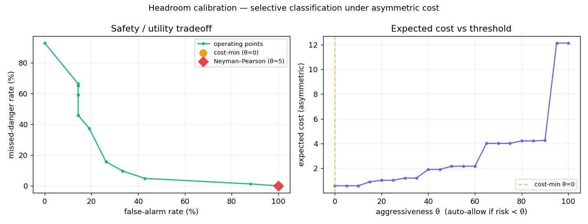

# AgentGuard

### A human-in-the-loop firewall for AI coding agents — and a measurement study of *when* to trust the human.
*OpenClaw gives agents hands. AgentGuard gives them brakes.*

AI agents now **run** code — deploy, delete, push to `main`. The usual safety answer is a human-approval gate. But a pause button is the easy part; the hard part is the **judgment** (which actions to stop) and the fact that the **human reviewer is subjective and gets tired**. AgentGuard is both a working gate *and* the apparatus that **measures** that judgment instead of guessing at it.

**Two things at once, on purpose:**
- 🛠️ **The system** — a worker LLM agent proposes actions; a guardian (deterministic rules + LLM risk judgment) classifies each **safe / approval-required / blocked**; risky ones pause the agent mid-task (LangGraph `interrupt()`) and wait for a human; every decision is audit-logged on a live dashboard with an interactive **calibration dial**.
- 📊 **The measurement** — we frame the guard as *selective classification under asymmetric cost with noisy labels and a fatiguing reviewer*, and measure it: a calibration curve, a noise floor (Fleiss' κ = 0.52), the safety-vs-oversight **inverted-U**, a flooding **attack**, and model-dependence — five figures, all reproducible. *(Honest scope: an applied/measurement project. The mechanisms — fatigue-aware deferral, flooding attacks — are prior art we cite; the contribution is the open-source system + the measurement. See **[docs/DRAFT.md](docs/DRAFT.md)**.)*

> *Anyone can stop an agent. AgentGuard measures **when** to — and shows the cost of every setting.*

**See it in 60 seconds (no API key):** `uvicorn agentguard.api:app` → open the dashboard → **Run demo** (watch a `rm -rf` get blocked and a prod deploy pause for approval) → scroll to **Calibration explorer** and drag the dial.

## The problem (why this isn't "just a pause button")

As agents get real hands — deploy, delete, spend money, touch prod — the bottleneck isn't *can* we stop them; frameworks already do that. The bottleneck is *can we trust the thing deciding when to stop them.* Over-gate and humans rubber-stamp every alert until the guard is useless; under-gate and something blows up. Today that line is usually set by vibes. AgentGuard sets it **with data**.

## How it works

```
worker agent → proposes action → guardian (rules → LLM) ─┬─ SAFE     ▸ run
                                                         ├─ BLOCKED  ▸ deny
                                                         └─ APPROVAL ▸ pause (interrupt)
                                                                       → human approve / reject
                                                                       → resume / abort
                                          → append-only audit log + live dashboard
```

The gate is the **substrate**. The **moat** is the layer above it: measuring whether the gate's judgment is any good.

## The calibration eval (the moat)

The guardian emits a **0–100 risk score** per action. Sweeping the auto-allow-vs-escalate threshold produces the **safety/utility tradeoff curve** — missed-danger rate vs false-alarm rate — under an **asymmetric cost matrix** (auto-allowing danger is catastrophic; a false alarm is annoyance).

```bash
python -m eval.calibrate            # prints the sweep + cost-min & Neyman-Pearson points + AURC
python -m eval.calibrate --plot     # also writes eval/calibration.png
```



On a **125-action hand-labeled set** deliberately weighted to *hard* cases — ambiguous-middle, obfuscated/adversarial (base64 `rm -rf`, homoglyph `maín`, path traversal, exfil), and scary-but-benign traps (small, reported as such — not a published benchmark) — the curve tells the honest story: against adversarial/ambiguous inputs the guard **cannot safely auto-decide** — reaching 0% dangerous-miss forces escalating almost everything (cost-minimizing policy ≈ "ask the human about everything"). That's the artifact *and* the finding: you read the guard's real operating limits off the curve with data — and on hard inputs it can't filter safely, which is exactly what forces high escalation onto a human (→ the research direction below).

**The noise floor — why a single "ground truth" is a lie.** "Is this action risky?" is *subjective*: even careful reviewers disagree, so a guard can't be scored against one objective label. `python -m eval.noise_floor` has three LLM-persona reviewers (cautious / pragmatic / strict-compliance) label the 125-action set and reports **Fleiss' κ ≈ 0.52** — only *moderate* agreement, and the *pragmatic* reviewer labeled **87 actions SAFE vs the cautious one's 45** (that gap **is** the risk-tolerance axis). That's the *irreducible* disagreement, and it's the honest yardstick: a guard that agrees with reviewers as often as they agree with each other is at "human" level. *(Personas are a **proxy** for human annotators — reported as such, not the true human floor.)*

> **Precision note (so the claim is exact):** the curve is **operating-point analysis under asymmetric cost** (selective classification) — *not yet formal calibration* in the ECE/reliability sense. "Calibration" is the theme; the claim is precisely the measured tradeoff + noise floor above. Formal calibration metrics (ECE, Brier, reliability diagrams), an adversarial/evasion set, published benchmarks (AgentDojo, InjecAgent), and frontier methods (conformal prediction, trajectory-level guarding) are deeper rigor on the roadmap — see **[Stage 1](ROADMAP.md)**.

> **The throughline:** *Stopping an agent is a framework feature. Knowing when to stop it — selective classification under asymmetric cost with label noise — is the problem, and here's the curve that shows the tradeoff and lets me set the operating point with data.*

## Research direction — "Oversight Has a Capacity"

The deepest version of the thesis (full detail → **[docs/RESEARCH.md](docs/RESEARCH.md)**). Agent safety is usually modeled as a *perfect, infinite human* checking a fallible agent against a *ground-truth* "safe." All three are false: the label is **subjective** (no ground truth; measured Fleiss' κ ≈ 0.52), the human is **endogenous** (escalation fatigues them — the guard degrades its own oracle), and the cost is **asymmetric**. So the optimal *when-to-escalate* policy must be **load-aware**, and realized safety is an **inverted-U**:

> **more human oversight can make a system *less* safe — the safety-optimal guard escalates *below* the human's capacity.**

That's *selective classification under asymmetric cost with noisy labels **and an endogenous expert*** — the last clause is **prior art** (FALCON / DeCCaF), which we *demonstrate* in the LLM-agent setting via a simulated inverted-U experiment.

**Scope, stated honestly:** this matters **only where the judgment is subjective with delayed outcomes** (agent oversight, content moderation, alert triage) — **not** where there's objective ground truth (e.g. banking fraud, where you just use the better predictor). And it's **honestly positioned**: a novelty check confirmed the core mechanisms are *prior art* — the endogenous-fatiguing-reviewer + load-aware deferral is **FALCON / DeCCaF**, the flooding attack is SOC alert-fatigue, trajectory guarding is ShieldAgent et al. **This is an applied / measurement / systems project, not a novel-theory paper** — the contribution is the open-source firewall + the measurement that brings these ideas together for LLM agents.

> The **working paper draft** is **[docs/DRAFT.md](docs/DRAFT.md)** (built from the figures + real numbers); the **skeleton + intellectual journey** is **[docs/PAPER.md](docs/PAPER.md)**.

## Getting Started

```bash
pip install -r requirements.txt        # or: uv sync
cp .env.example .env                    # add ANTHROPIC_API_KEY (and optional LangSmith key)
```

## Usage

```bash
uvicorn agentguard.api:app              # dashboard → http://localhost:8000 (Run demo needs no key)
```

The dashboard shows a live activity feed, pending approvals with the guardian's reasoning, approve/reject, and a per-run cost line. The **Run demo** button drives a full SAFE → BLOCKED → APPROVAL flow with **no API key**. A **Calibration explorer** lets you *drag* the guard's aggressiveness and watch the missed-danger vs false-alarm tradeoff recolor across all 125 actions in real time — the curve made tangible, replaying saved scores (no API calls). Run `python -m eval.calibrate` once to populate it.

## Plug it into your own agent (MCP)

AgentGuard is also an **MCP server**, so *your own* agent — Claude Code, Cursor, or a custom one — can route its actions through the guard. The agent doesn't open this app; it calls two tools (`submit_action_for_review`, `check_review`) before it acts. Add ~4 lines to your MCP client config:

```jsonc
{ "mcpServers": { "agentguard": { "command": "python", "args": ["-m", "agentguard.mcp_server"] } } }
```

Now when *your* agent wants to `git push` or `rm -rf`, it asks AgentGuard first — which returns **allow** / **blocked**, or **pending** (queued for a human to approve on the dashboard). See it without a real client:

```bash
python scripts/mcp_demo.py               # an external agent submits 3 actions over MCP → verdicts
python -m agentguard.mcp_server          # run the MCP server itself (stdio)
```

> *Cooperative integration (the agent is configured to ask). True no-bypass — gateway / host-hook / sandbox — is the [enforcement ladder](ROADMAP.md) above this.*

## Development

```bash
pytest                                  # unit + integration (no API key needed)
python -m eval.run_eval                 # guardian confusion matrix + recall / precision
python -m eval.calibrate --plot         # the calibration curve (cost matrix, sweep, NP point, AURC) + PNG
python -m eval.noise_floor              # inter-annotator kappa — the noise floor (LLM-persona proxy)
bash scripts/smoke-check.sh             # key-file checks + pytest
```

Evaluation is **cost-aware by design** — prompt caching, the Message Batches API, pre-recorded worker traces, and stratified sampling, with a built-in judge cost/cache meter (`GET /api → judge_cost`). Methodology and targets → **[docs/EVAL.md](docs/EVAL.md)**.

## Stack

Python 3.12 · LangGraph (`interrupt()` HITL + SqliteSaver) · langchain-anthropic (Claude) · FastAPI · SQLite · MCP (FastMCP) · LangSmith · Tailwind-CDN dashboard.

## License

MIT — see [LICENSE](LICENSE).
