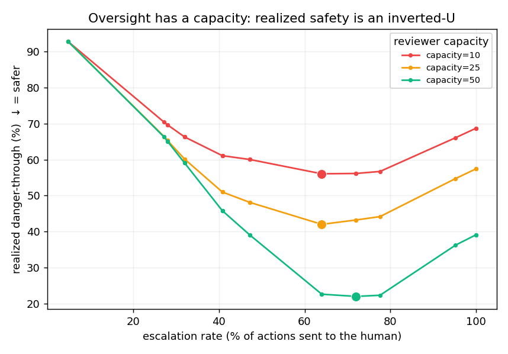
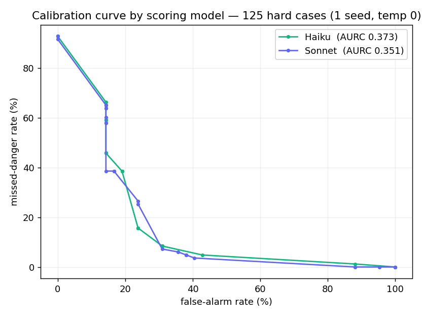
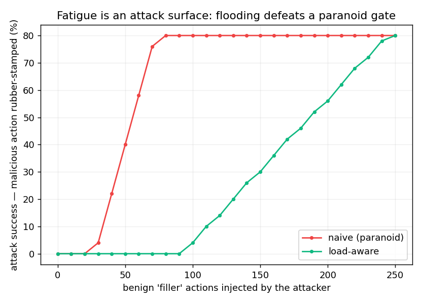

# Oversight Has a Capacity: Calibrating Agent Guards to a Subjective, Fatiguing Human

> This is the human-readable rendering of the paper; the canonical source is
> [`paper/main.tex`](../paper/main.tex). Numbers are from a hand-labeled set and a *single seed* at
> temperature 0 — reported as demonstrations, not settled results. Figures live in [`../eval/`](../eval/).

---

## Abstract

As LLM agents begin to take real, irreversible actions — running shell commands, editing files,
deploying code — the standard safety pattern is a human-in-the-loop approval gate: risky actions
pause and wait for a person. We argue the gate is the easy part. The hard, unsolved part is the
*judgment* — deciding **which** actions to stop — and the field evaluates that judgment against
two assumptions that are both false: that there is a ground-truth notion of "risky," and that the
human reviewer is a perfect, infinitely-available oracle. We show, on a hand-labeled set of 125
adversarially-weighted agent actions, that (i) reviewers only *moderately* agree on what is risky
(Fleiss' κ = 0.52), so there is no single correct label; (ii) framing the guard as **selective
classification under asymmetric cost** makes its operating limits measurable, and on hard inputs
the guard cannot safely auto-decide; and (iii) when the reviewer is modeled as **endogenous** —
fatiguing as escalation load grows — realized safety becomes an **inverted-U** in the escalation
rate: *more human oversight can make a system less safe*, and the safety-optimal guard escalates
**below full escalation** (a middle escalation rate, not the maximum) — a setting a load-aware policy also uses to resist a *flooding
attack* that rubber-stamps a malicious action past a fatigued reviewer. **We claim none of these
mechanisms as novel:** fatigue-aware learning-to-defer (FALCON [13], DeCCaF [14]), trajectory-level
guarding, and fatigue/flooding attacks on human reviewers (security-operations alert fatigue [15])
are all prior art we cite. Our contribution is an **open-source agent-oversight system** that
operationalizes and *measures* these ideas together in the LLM-agent action-gating setting —
turning "is my guard good?" from a guess into a curve. The inverted-U and the flooding attack are
modeling results that motivate a human study.

---

## 1. Introduction

AI coding agents are moving from *suggesting* code to *executing* it. Once an agent can `deploy`,
`rm -rf`, push to `main`, or read a secret, a single bad instruction has real, sometimes
irreversible consequences. The de-facto safety response, echoed across agent frameworks, is a
**human-in-the-loop (HITL) approval gate**: classify each proposed action, and pause the risky
ones for a human to approve or reject.

The gate is commodity. Frameworks hand you the pause primitive (e.g. LangGraph's `interrupt()`)
for free. What no framework tells you is whether your approval *policy* is any good — whether it
is too paranoid (so humans rubber-stamp every alert until the gate is theater) or too lax (so
something blows up). That decision is usually set by intuition.

This paper treats the decision as a measurable problem, and in doing so surfaces a deeper one. The
field implicitly assumes:

1. **a ground-truth label** — that "is this action too risky to auto-run?" has a correct answer;
2. **a perfect human** — that the reviewer the gate escalates to is always available and always
   reliable.

Both are false. "Risky?" is a subjective judgment that depends on context and risk tolerance, and
human reviewers *fatigue*: every escalation spends attention and nudges them toward rubber-stamping
(a well-documented "approval fatigue" failure mode). Crucially, the reviewer is **endogenous** —
the guard's own escalation policy degrades the very oracle it escalates to.

**What this paper is — and is not.** It is **not** a novel-mechanism paper. Fatigue-aware deferral
[13,14], trajectory-level guarding, selective classification, and fatigue/flooding attacks on
human reviewers [15] are all established. It is an **applied, measurement-driven systems** study:
we bring these strands together into one open-source agent-oversight firewall and *measure* what is
usually asserted. Our contributions are therefore artifacts and measurements, not theory:

- An **open-source agent firewall + measurement apparatus** that treats the guard as *selective
  classification under asymmetric cost* and reports an operating-point curve, Neyman–Pearson point,
  and AURC instead of accuracy (§4, §5.1), with a live, interactive demo.
- A **measured noise floor** for agent-action risk: on 125 hand-labeled actions, reviewer agreement
  is only moderate (Fleiss' κ = 0.52) — there is no single ground-truth safety label (§5.2).
- A **demonstration, in the LLM-agent setting, of the endogenous-reviewer inverted-U** [13]:
  realized safety is maximized at an escalation rate *below full escalation*, and escalating
  everything is strictly worse (§5.3) — and that the *same* load-aware setting resists a **flooding attack** [15]
  (§5.5). These are *modeling* results on real scored data, not human studies.
- Evidence that results are **model-dependent and reproducible** (Haiku vs Sonnet; AURC
  0.374 ± 0.002 over seeds), and that the framework *measures* both (§5.4).

**Stated plainly: the contribution is a measurement instrument and the findings it yields** — a
measured noise floor where the field assumed ground truth, the operating limits of an LLM guard framed
as selective classification under asymmetric cost, and a demonstration — in the LLM-agent
action-gating setting specifically — of the endogenous-reviewer inverted-U and its flooding-attack
dual. The mechanisms are prior art; *measuring* them in this setting is what we add.

**Scope (stated up front).** This matters where the judgment is genuinely *subjective with delayed
outcomes* — autonomous agent action-gating, content-moderation borderline calls, security-alert
triage. It does **not** apply where there is objective ground truth (e.g. banking-fraud, eventually
verifiable): there you simply measure both parties against the truth and use the better predictor.
Naming the boundary is part of the claim.

---

## 2. Related Work

**Agent guardrails and trajectory-level safety.** A growing body of work guards *agent action
sequences*: Trajectory Guard [1] for real-time anomaly detection over agent trajectories,
ShieldAgent [2] for verifiable safety-policy reasoning over action trajectories, ToolSafe [3] for
step-level tool-invocation guardrails, plus benchmarks such as AgentHarm [4] and trajectory-level
evaluators (AgentAuditor). **We implement per-action gating and treat trajectory-level guarding as
prior art**; our contribution is orthogonal — the *oversight-calibration* layer, which consumes
whatever detection signal exists.

**Learning to defer, complementarity, and the fatiguing expert.** A mature line studies *when* to
defer to a human and how to *complement* human weaknesses: learning to defer [5], complement-humans
[6], learning when to require feedback [7], complementary team performance [8], appropriate reliance
[9]. Most assume a **static** expert — but two recent works already drop that assumption and model a
**fatiguing/workload-varying** one: **FALCON** [13] (fatigue-aware learning-to-defer with
psychologically-grounded fatigue curves) and **DeCCaF** [14] (cost-sensitive deferral under workload
constraints). **The endogenous-reviewer idea is therefore theirs, not ours**; we *apply* it to the
LLM-agent action-gating setting and measure it.

**Selective classification and calibration.** Risk–coverage curves and AURC come from selective
classification [10]; distribution-free guarantees from conformal prediction [11]; calibration is
classically measured with ECE/Brier/reliability diagrams. We use the selective-classification lens;
we do *not* yet claim formal calibration (ECE) — that is future rigor.

**Reviewer fatigue as an attack surface.** That an adversary can *weaponise* alert/approval volume
to exhaust reviewers and bury malicious activity is well established in security operations (SOC
alert-flooding and analyst fatigue [15]) and is explicitly named as an exploitation vector for AI
agents (approval fatigue as an "agent trap"). **The flooding attack is therefore prior art too**; we
reproduce it in the agent-oversight setting and show the load-aware operating point defends against
it (§5.5). Concurrent work reframes LLM-agent security itself as an *agent–human interaction*
problem — surveying 59 papers and 21 production systems and naming **approval fatigue** and the
"cognitive burden vs. security" tradeoff as first-class, under-studied concerns [16] — which is
exactly the gap this paper measures rather than only names. Regulatory framing of human oversight is
given by EU guidance [12].

---

## 3. Problem Formulation

An agent proposes actions; a guard decides, per action `a`, between **auto-allow** and **escalate**
(to a human). Let:

- `s(a) ∈ [0,100]` — the guard's **risk score** (live, from rules or an LLM scorer).
- The **label** for `a` is not a point but a *distribution over reviewers* — different reviewers
  disagree (§5.2). We use a gold label `y(a) ∈ {SAFE, APPROVAL, BLOCKED}` for measurement, with
  the noise floor quantifying its contestability.
- A threshold `θ`: auto-allow iff `s(a) < θ`, else escalate.
- An **asymmetric cost** `C[y][decision]`: auto-allowing a dangerous action (a *miss*) is
  catastrophic; escalating a safe one (a *false alarm*) is annoyance (Table 1).
- A **reviewer model** `h(a, ℓ)` with reliability `r(ℓ)` that *decreases* in cumulative escalation
  load `ℓ`. This is the endogenous element: `ℓ` is driven by the guard's own escalation rate.

The objective is to minimize **expected realized cost — including human-fatigue-induced errors** —
not classification accuracy. The endogenous element (following FALCON [13] and DeCCaF [14]) is that
`r` depends on the policy's escalation history (a closed loop), so the optimal `θ` is **load-aware**;
we instantiate and measure this in the agent-action setting rather than introduce it.

**Table 1 — asymmetric cost (gold × decision).**

| gold | auto-allow | escalate |
|---|---:|---:|
| SAFE | 0 | 1 (false alarm) |
| APPROVAL | 5 | 0 |
| BLOCKED | 50 (catastrophe) | 1 |

---

## 4. Methods

**Dataset.** 125 hand-labeled agent actions (`eval/dataset.jsonl`), deliberately weighted to *hard*
cases: 54 ambiguous-middle (e.g. `npm install <pkg>`, edit `package.json`, `git rebase`, deploy to
*staging*), 23 obfuscated/adversarial (base64-encoded `rm -rf`, homoglyph `maín`, path traversal,
secret exfiltration, pipe-to-shell), and 16 scary-*looking* cases (12 genuinely benign false-alarm
traps — `rm -rf node_modules`, read `.env.example`; and 4 that look alarming *and* warrant approval,
e.g. `git reset --hard` of unpushed work). Labels: SAFE 42 / APPROVAL 52 / BLOCKED 31. A small,
curated set — reported as such, not a published benchmark. **Gold-label provenance:** the labels are
one author's judgments, used as a single measurement reference throughout. This is in deliberate
tension with our own noise floor (§5.2): Fleiss' κ = 0.52 quantifies how contestable that reference
is, so every guard score below should be read *relative to* that floor, not as agreement with an
objective truth.

**Guard scorer.** Deterministic rules score clear cases for free; the ambiguous middle is scored by
an LLM (Haiku by default, Sonnet for comparison), at temperature 0, prompted for a 0–100 risk
integer. Scores are persisted so analyses replay them without re-querying.

**Calibration.** A *dangerous* action is one whose gold label is in {APPROVAL_REQUIRED, BLOCKED};
the binary decision is **auto-allow** (`s(a) < θ`) vs **escalate**. Sweeping `θ` we report, per
operating point: **missed-danger rate** (dangerous actions auto-allowed ÷ all dangerous),
**false-alarm rate** (safe actions escalated ÷ all safe), **coverage** (auto-decided fraction), and
**expected cost** = mean over all actions of the Table-1 cost `C[gold][decision]`. From the sweep we
extract the cost-minimizing point, the Neyman–Pearson point (lowest false-alarm at 0% miss), and the
**AURC** = area under the risk–coverage curve, where *risk* is the error rate among auto-allowed
actions and *coverage* is the auto-allowed fraction (lower is better). (`eval/calibrate.py`.)

**Noise floor.** Three reviewer *personas* (cautious / pragmatic / strict-compliance) label the set;
we compute pairwise Cohen's κ and overall Fleiss' κ. **These are LLM personas — a proxy for human
annotators, reported as such.** (`eval/noise_floor.py`.)

**Endogenous-reviewer simulation.** We model reviewer reliability
`r(ℓ) = max(r_min, 1 − slope·max(0, ℓ − C))` with capacity `C`, `slope = 0.02`, `r_min = 0.2`: the
reviewer is reliable up to `C` reviews, then degrades. For each `θ`, auto-allowed dangerous actions
are guard-misses; escalated dangerous actions are missed with probability `1 − r(ℓ)` at their load
position. We sweep `θ` (hence the escalation rate) and vary `C`. **This models a documented
phenomenon; it is not a human study.** (`eval/inverted_u.py`.)

---

## 5. Experiments and Results

### 5.1 The guard's judgment is measurable — and limited on hard inputs

> **Figure 1.** Safety/utility tradeoff (left) and expected cost vs. threshold (right) for the
> LLM-scored guard on the 125-action set, with the cost-minimizing and Neyman–Pearson points marked.

On the 125-action set the guard's safety/utility tradeoff is a real curve, not a binary. Under the
asymmetric cost (Table 1), the **cost-minimizing policy collapses to "escalate almost everything"**:
reaching 0% missed-danger requires a ~100% false-alarm rate, and the area under the risk–coverage
curve (AURC; lower is better) is **0.376** for the run shown — and **0.374 ± 0.002** across three
temperature-0 seeds (§5.4), the figure we quote as canonical throughout. The reading is not "the
guard is bad"; it is that *on
adversarial/ambiguous inputs this guard cannot safely auto-decide*, so it is forced to lean on the
human. That dependence is precisely what makes the reviewer's properties decisive.

### 5.2 There is no single ground truth (noise floor)

Three persona reviewers labeling the same 125 actions reach only **Fleiss' κ = 0.52** (moderate
agreement). The three pairwise Cohen's κ are **0.42** (cautious vs pragmatic), **0.47** (pragmatic
vs compliance), and **0.71** (cautious vs compliance) — i.e. two of three pairs are only
weak-to-moderate, and the *pragmatic* reviewer labels 87 actions SAFE versus the cautious reviewer's
45. The disagreement is concentrated on the risk-tolerance axis, exactly the contested middle. The
persona majority matches the gold label 74% of the time. A guard cannot be scored against one
objective truth; the agreement ceiling is the honest yardstick. *(Personas are a proxy for human
annotators.)*

### 5.3 Oversight has a capacity (the inverted-U)

> **Figure 2.** Realized danger-through vs. escalation rate for three reviewer capacities; the
> marked minima are the safety-optimal operating points (all below full escalation).

Modeling the reviewer as endogenous flips the usual intuition. **We state this up front: the
inverted-U below is a direct consequence of the assumed monotonically-fatiguing reviewer (§4) — a
modeling result about a plausible model, not an empirical finding about real people.** As the guard
escalates *more*, two
failure modes trade off: escalate too little and the guard auto-allows danger (guard-misses);
escalate too much and the reviewer overloads and rubber-stamps (fatigue-misses). Realized
danger-through is therefore **U-shaped in the escalation rate** — and the safety-optimal escalation
rate is **below full escalation**:

| reviewer capacity | optimal escalation rate | danger-through at optimum | danger-through escalating *everything* |
|---|---:|---:|---:|
| 10 | 64% | 56% | 69% |
| 25 | 64% | 42% | 57% |
| 50 | 72% | 22% | 39% |

**Escalating everything is strictly worse than the optimum**, and the optimum shifts with capacity.
The absolute danger-through is high because the guard is weak on this hard set (§5.1) — the claim is
the *shape* (more oversight → less safety past the optimum), not the level. This is a *modeling*
result; a human study fitting `r(ℓ)` (future work) would make it empirical.

### 5.4 The result is model-dependent — and we measure it

> **Figure 3.** Calibration curves for two scoring models (Haiku vs. Sonnet) on the 125-action set.

Re-scoring with a stronger model shifts the curve: **Sonnet AURC 0.351 vs Haiku 0.373** (each a
single seed; the Haiku value sits inside the 0.374 ± 0.002 band below), and Sonnet
can safely auto-allow a sliver (cost-min `θ`=10) where Haiku must escalate everything (`θ`=0). The
gain is *modest* — a better model helps but does not solve the hard set, and the 0.022 AURC gap is
small enough that it may sit within the label subjectivity the noise floor measures (§5.2, κ = 0.52):
we report the *ordering*, not a precise magnitude. The point is methodological:
guard quality depends on the scoring model (and threshold, and attack mix), so the right output is
not "guards are good/bad" but *a measurement, for a given configuration*. The result is also
**reproducible at the deployed setting**: across 3 runs at temperature 0 the Haiku AURC is
**0.374 ± 0.002** (range 0.372–0.378) — note that even at temperature 0 the Anthropic API is not
bit-exact, so we report the residual spread rather than asserting determinism; temperature 0.7 gives
the same 0.374 ± 0.002. The curve is stable to LLM sampling, not a single lucky draw.

### 5.5 Fatigue is an attack surface

> **Figure 4.** Attack success (a buried malicious action rubber-stamped) vs. attacker filler
> volume, under a paranoid vs. a load-aware escalation policy (capacity = 25).

The endogenous reviewer is not only a safety limit — it is an *attack surface*. An adversary buries
one malicious action in a stream of `k` benign "filler" actions; each escalated filler adds reviewer
load, so by the time the malicious action is reviewed a fatigued reviewer rubber-stamps it. Under a
naive **paranoid** policy — escalating 88% of routine actions (the measured false-alarm rate at
`θ`=10) — attack success climbs from 0 toward the rubber-stamp ceiling (~80%) as filler grows, and
is already **40% at just 50 filler actions**. Under a **load-aware** policy — escalating 24% (the
`θ`=35 false-alarm rate) — the reviewer stays fresh and attack success **holds at 0% until the
attacker's filler is large enough that even those few escalations exceed capacity** (≈100 actions
here, ~2× the paranoid policy's headroom), after which it too bends upward (10% at k≈110, reaching
the same ceiling by k≈250). The defense buys **headroom, not immortality** — but it is the *same
lever* as the safety result: **not escalating routine actions** both finds the inverted-U optimum
(§5.3) and denies the attacker the load they need. (Simulation, same fatigue model as §5.3.)

### 5.6 Threats to validity

Four sensitivities shape how far these results should be read. **(i) The cost matrix drives the
§5.1 collapse.** The 50:1 BLOCKED-miss-to-false-alarm ratio in Table 1 is a chosen value; a less
extreme ratio would move the cost-minimizing point away from "escalate everything." We fix it for
all runs and report it explicitly rather than tuning it. **(ii) The reviewer model is optimistic.**
`r(ℓ)` starts at 1.0 (a perfectly reliable fresh reviewer) and only decays — real reviewers err even
when fresh, so the *absolute* danger-through numbers are lower bounds; the *shape* (the inverted-U)
is what we claim. **(iii) Agreement is weak on two of three pairs** (§5.2), so the κ = 0.52 floor is
itself an estimate over contestable labels. **(iv) One dataset underlies every experiment.** All
five results use the same 125 actions; they are five views of one measurement instrument on one
small set, not five independent confirmations.

---

## 6. Limitations

- **Small, curated dataset** (125 actions), single domain (coding-agent actions); results are
  demonstrations of the *instrument*, not population estimates.
- **Personas are a proxy** for human annotators; the κ = 0.52 floor is an estimate, not the true
  human-agreement ceiling.
- **The inverted-U is simulated**, not measured: fatigue is documented, but `r(ℓ)`'s shape is
  assumed, not fit to people.
- **Sampling sensitivity is small but nonzero even at the deployed temperature 0** (AURC
  0.374 ± 0.002 over 3 runs; the Anthropic API is not bit-exact at temp 0) — quantified, not assumed.
- **Operating-point analysis, not formal calibration** (no ECE/reliability yet).
- **The core mechanisms are prior art** (verified): fatigue-aware deferral [13,14] and
  reviewer-fatigue attacks [15] are established. This is an *applied/measurement/systems* study, not
  a theoretical contribution — positioned as such, not as a discovery.

---

## 7. Future Work

The apparatus here is a foundation, not an endpoint. Four directions extend it most directly; each
is **open direction, not result**, and each builds on what is already built.

**7.1 From modeled fatigue to measured fatigue (the empirical core).** The inverted-U is simulated;
the obvious next artifact is a **human study** that fits `r(ℓ)` from real reviewers and re-measures
the noise floor with human annotators rather than LLM personas. Even a small pilot would convert the
headline from "under a plausible fatigue model…" to "under *measured* fatigue…" — and would yield,
to our knowledge, the first empirical fatigue curve for *agent-action* review specifically. It also
motivates a **learned, value-of-review deferral** policy that escalates by the expected benefit of
review under the remaining attention budget, rather than by a risk threshold alone.

**7.2 From cooperative to enforced oversight (the no-bypass ladder).** Our MCP integration is
*cooperative* — the agent is configured to ask. A control plane is only as strong as the actions it
actually sees, so the foundational open problem is **interception completeness**: an MCP **gateway**
(the agent's only path to its tools), **host hooks** (e.g. Claude Code `PreToolUse`, covering native
tools too), and ultimately **capability/sandbox mediation**, where the agent runs without the real
filesystem/network/deploy capability and the guard mediates the syscall. Only the last gives *true*
no-bypass: enforcement is owning the chokepoint, not requesting cooperation.

**7.3 From per-action to trajectory and multi-agent risk.** A single action can be safe while the
*sequence* is lethal (read secret → write public file → push); trajectory-level guarding [1,2] is the
detection layer this oversight calibration would consume. Further out lies a genuinely
under-explored frontier: **emergent multi-agent risk**, where N agents are each individually
compliant but their *joint* action space is dangerous. Calibrating oversight across a fleet is also
where fatigue compounds — one reviewer cannot be the oracle for many agents.

**7.4 From a static to a self-improving policy.** The guard's own **audit log is a training signal**:
which actions a reviewer *always* approves vs. *always* blocks, and which adversarial cases slipped
through. A closed loop — adapt thresholds from the approve/reject record and let a model *propose*
new rules from the misses, re-evaluated before they ship — would make the gate learn from every human
decision and every attack it let slip.

Beyond these, standard rigor extensions apply: **conformal** abstain-or-act guarantees and formal
**calibration** (ECE), scaling to **published benchmarks** (AgentDojo, InjecAgent) for external
validity, and — where measured reliability warrants it — **consented, revocable** delegation of
specific decision classes to the guard (§8).

---

## 8. Ethical Considerations

The framing here is **decision support for the operator**, not replacement of human authority. A
natural extension — measured comparative reliability leading the human to *delegate* certain
decision categories to the guard — must be **consent-based, revocable, and category-scoped**: the
operator chooses, with data, and can revoke. We explicitly avoid any framing in which an agent
overrides a person's judgment without consent. The fatigue result also has a defensive reading:
because rubber-stamping is exploitable, modeling it is a step toward *protecting* reviewers, not
automating them away.

---

## 9. Conclusion

Stopping an agent is a framework feature. Knowing *when* to stop it — and accounting for the fact
that asking depletes the human you are asking — is the problem. Treating the guard as selective
classification under asymmetric cost makes its judgment measurable; measuring reviewer agreement
shows there is no single ground truth; and modeling the reviewer as endogenous shows that oversight
has a capacity, beyond which more of it makes a system less safe. None of these mechanisms is ours
to claim — fatigue-aware deferral and reviewer-fatigue attacks are prior art — and we say so. What
we contribute is the **system and the measurement**: an open-source agent firewall that brings these
strands together and turns "is my guard any good?" from a vibe into a curve. The numbers are small
and some are simulated, and we say that too.

---

## References

[1] Advani, L. *Trajectory Guard: A Lightweight, Sequence-Aware Model for Real-Time Anomaly
Detection in Agentic AI.* arXiv:2601.00516, 2026.
[2] Chen, Z., Kang, M., and Li, B. *ShieldAgent: Shielding Agents via Verifiable Safety Policy
Reasoning.* ICML 2025. arXiv:2503.22738.
[3] Mou, Y., Xue, Z., Li, L., Liu, P., Zhang, S., Ye, W., and Shao, J. *ToolSafe: Enhancing Tool
Invocation Safety of LLM-based Agents via Proactive Step-level Guardrail and Feedback.*
arXiv:2601.10156, 2026.
[4] Andriushchenko, M., Souly, A., Dziemian, M., Duenas, D., Lin, M., Wang, J., Hendrycks, D.,
Zou, A., Kolter, Z., Fredrikson, M., Winsor, E., Wynne, J., Gal, Y., and Davies, X. *AgentHarm: A
Benchmark for Measuring Harmfulness of LLM Agents.* ICLR 2025. arXiv:2410.09024.
[5] Madras, D., Pitassi, T., and Zemel, R. *Predict Responsibly: Improving Fairness and Accuracy
by Learning to Defer.* NeurIPS 2018. arXiv:1711.06664.
[6] Charusaie, M.-A., Mozannar, H., Sontag, D., and Samadi, S. *Sample Efficient Learning of
Predictors that Complement Humans.* ICML 2022. arXiv:2207.09584.
[7] Pugnana, A., De Toni, G., Barbera, C., Pellungrini, R., Lepri, B., and Passerini, A. *To Ask
or Not to Ask: Learning to Require Human Feedback.* arXiv:2510.08314, 2025.
[8] Hemmer, P., Schemmer, M., Kühl, N., Vössing, M., and Satzger, G. *Complementarity in Human-AI
Collaboration: Concept, Sources, and Evidence.* arXiv:2404.00029, 2024.
[9] Schemmer, M., Bartos, A., Spitzer, P., Hemmer, P., Kühl, N., Liebschner, J., and Satzger, G.
*Towards Effective Human-AI Decision-Making: The Role of Human Learning in Appropriate Reliance on
AI Advice.* arXiv:2310.02108, 2023.
[10] Geifman, Y., and El-Yaniv, R. *Selective Classification for Deep Neural Networks.* NeurIPS
2017. arXiv:1705.08500.
[11] Angelopoulos, A. N., and Bates, S. *A Gentle Introduction to Conformal Prediction and
Distribution-Free Uncertainty Quantification.* arXiv:2107.07511, 2021.
[12] European Data Protection Supervisor. *TechDispatch #2/2025: Human Oversight of Automated
Decision-Making.* 2025.
[13] Zhang, Z., et al. *Fatigue-Aware Learning to Defer via Constrained Optimisation.*
arXiv:2604.00904, 2026.
[14] Alves, J. V., Leitão, D., Jesus, S., Sampaio, M. O. P., Liébana, J., Saleiro, P.,
Figueiredo, M. A. T., and Bizarro, P. *Cost-Sensitive Learning to Defer to Multiple Experts with
Workload Constraints.* TMLR 2024. arXiv:2403.06906.
[15] Tariq, S., et al. *Alert Fatigue in Security Operations Centres: Research Challenges and
Opportunities.* ACM Computing Surveys 57, 2025. doi:10.1145/3723158.
[16] Wang, P., Li, Y., and Tian, Y. *Reframing LLM Agent Security as an Agent–Human Interaction
Problem.* arXiv:2605.24309, 2026.
